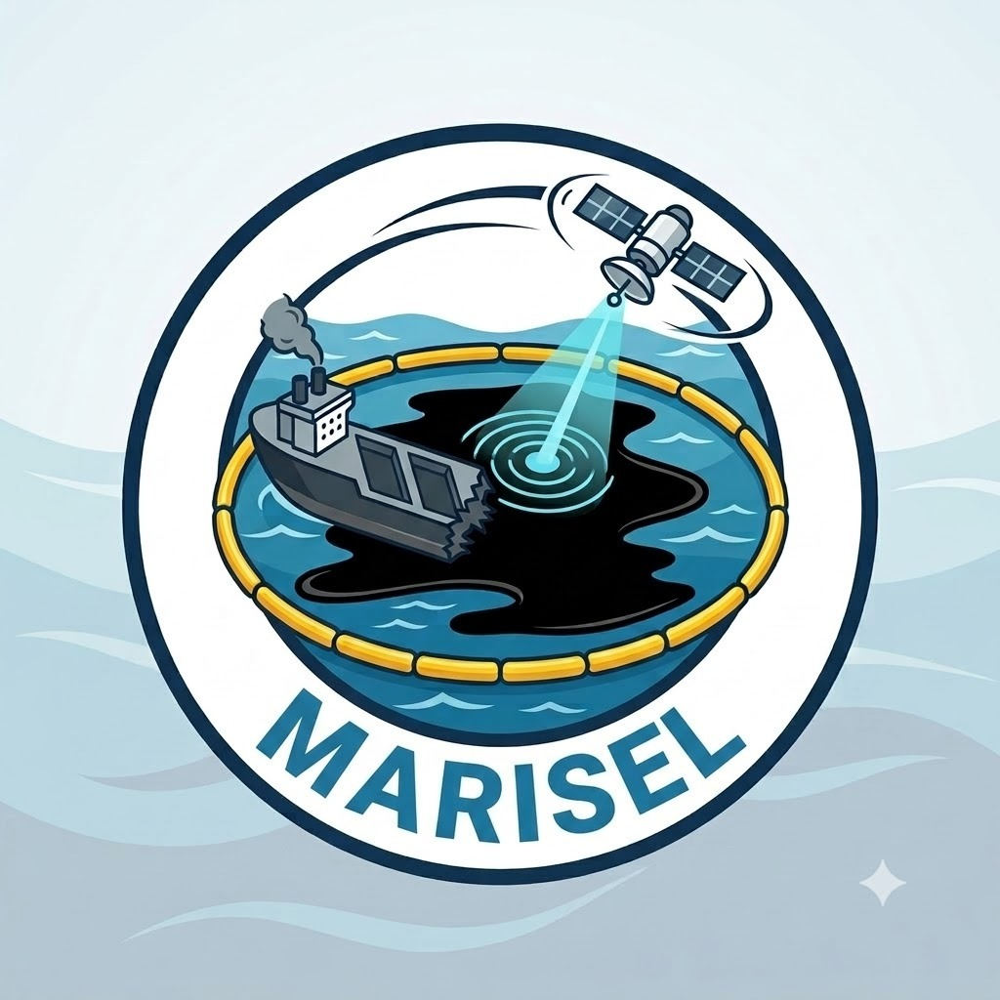

<div align="center">
  
  <h1>MARISEL</h1>
  <p><strong>Maritime Intelligence & AI Spill Attribution Platform</strong></p>
  <p><em>Built for Smart India Hackathon (SIH 143)</em></p>
</div>

---

## 🌊 Overview

**MARISEL** (formerly OILTRACE-X) is an advanced, autonomous maritime intelligence platform designed to rapidly detect, simulate, and attribute marine oil spills to their exact vessel of origin. Built for Port State Control and environmental enforcement agencies, MARISEL aggregates multi-modal data streams to construct a cryptographically secure, legally actionable "Guilt Matrix."

## 🚀 The 9-Step Architecture

The platform guides investigators through an automated pipeline:

1. **Spill Detection & Characterization**: Ingests Sentinel-1 SAR imagery to detect, mask, and characterize oil spill polygons using AI segmentation.
2. **Origin Reconstruction**: Utilizes backward-drift Monte Carlo simulations over hydrodynamic ocean models to identify the temporal and spatial origin of the spill.
3. **Vessel Tracking**: Live and historical AIS telemetry tracking near the reconstructed origin zone, complete with speed and heading interpolations.
4. **Rule Pre-filter**: Filters out non-suspect vessels based on geometric bounds, vessel type, and physical feasibility.
5. **Vessel Simulation**: High-performance HTML5 Canvas physical forward-simulations testing counterfactual drift patterns from candidate vessels.
6. **AI Agent Layer**: Multi-agent consensus engine auditing behavioral anomalies (e.g., "Dark Vessel" AIS gaps, route deviations).
7. **Evidence Fusion**: A dynamic, interactive knowledge graph linking physical, temporal, and behavioral evidence points into a cohesive inference web.
8. **Attribution Decision**: The final intelligence matrix, culminating in an automated legal standard judgment and confidence score.
9. **Outputs & Validation**: Secure generation of a cryptographically signed PDF dossier ready for prosecution or Port State Authorities.

## 🛠️ Technology Stack

- **Frontend Core**: React 18, TypeScript, Vite
- **Styling & UI**: Tailwind CSS, Lucide React (Icons), Framer Motion (Animations)
- **Mapping & GIS**: MapLibre GL JS, React-Map-GL (Dark Matter Carto Maps)
- **Physics Engine**: Custom HTML5 Canvas Lagrangian Particle Simulator (`requestAnimationFrame`)
- **Data Visualization**: Recharts, React Flow (Knowledge Graphs)

## 💻 Getting Started

### Prerequisites
- Node.js (v18 or higher recommended)
- npm or yarn

### Installation

1. Clone the repository:
   ```bash
   git clone https://github.com/Brijesh1021/Sih-143.git
   cd Sih-143
   ```

2. Install dependencies:
   ```bash
   npm install
   ```

3. Start the development server:
   ```bash
   npm run dev
   ```

4. Open your browser and navigate to `http://localhost:5173`.

## 🎨 UI/UX Philosophy

MARISEL is designed to look and feel like a highly classified, tactical intelligence command center. It features:
- **Glassmorphism & Dark Mode Widgets**: High contrast telemetry feeds on deep-space slate backgrounds.
- **Micro-interactions**: Live UTC clocks, pulsing radar locks, data stream simulations, and SVG laser scanning effects.
- **Fluid Layouts**: Zero wrapping, strictly aligned flex columns to prevent UI clutter on smaller screens.

## 📄 License

This project is developed for the Smart India Hackathon and is proprietary to the contributing team.

---
<div align="center">
  <sub>Developed with precision for SIH by the MARISEL team.</sub>
</div>
